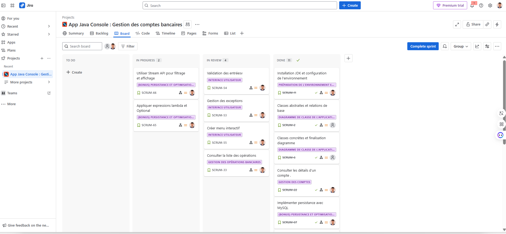
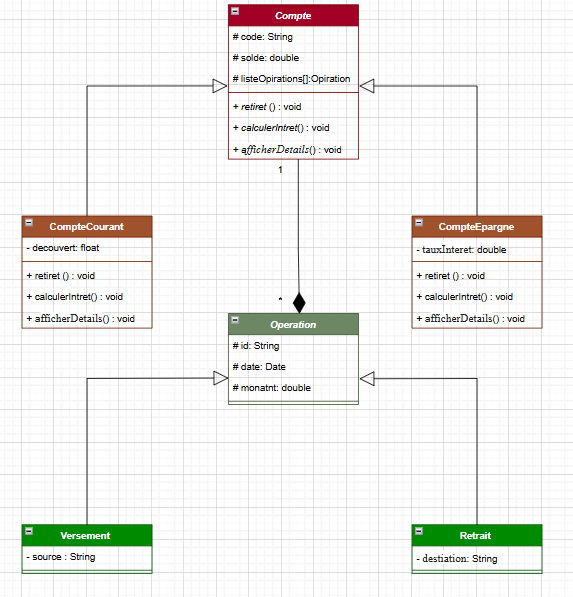
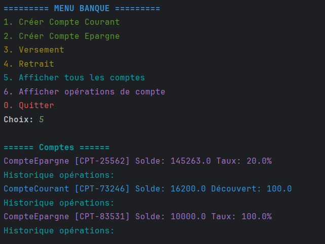

# 🏦 Système de Gestion des Comptes Bancaires

### Modernisation de la gestion bancaire via une application console Java 8 intuitive et robuste.

---

## 🌟 Aperçu du Projet

Ce projet propose une **application console Java** pour gérer les **clients**, **comptes courants et épargne**, ainsi que les **opérations bancaires** (versements, retraits, virements).  
L’application répond aux besoins d’automatisation d’une banque et respecte les standards de conception logicielle.

- **Gestion des comptes** : création, consultation, versement, retrait, virement.
- **Architecture claire** : séparation présentation, métier et utilitaires.
- **Suivi projet** : gestion des tâches via JIRA.

---

## 🛠️ Fonctionnalités

### Fonctionnalités principales :
1. **Création de compte** (courant ou épargne)
2. **Versement, retrait, virement** entre comptes
3. **Consultation du solde et des opérations**
4. **Validation des entrées utilisateur et gestion des exceptions**
5. **Menu interactif en console**
6. **Utilisation de Java Time API pour les dates**
7. **Stockage en mémoire avec ArrayList/HashMap**

### Bonus :
- Filtrage avec Stream API
- Persistance MySQL/JDBC (optionnel)
- Expressions lambda, Optional

---

## 📸 Screenshots & Diagrammes

### 📊 Planning JIRA
*Ajoutez ici une capture d’écran de votre tableau JIRA !*  


### 🗂️ Diagramme de Classe
*Ajoutez ici votre diagramme UML des classes !*  


### 🖥️ Aperçu de l’Application (console)
*Ajoutez ici des captures d’écran de l’application en fonctionnement !*  


---

## 🚀 Technologies Utilisées

- **Java 8 (JDK 8)**
- **Java Time API**
- **ArrayList, HashMap**
- **JIRA** (gestion de projet)
- **Git** (versioning)

---
## 📂 Structure du Projet

```plaintext
📁 Bank-account-management/
├── .gitignore
├── brief 1.iml
├── README.md
├── .idea/
├── .vscode/
├── diagram de class/
│   └── class_diagram.png
├── screenshots/
│   ├── app_screenshot.png
│   └── jira_board.png
├── src/
│   ├── 📁 dao
│   │   ├── CompteDao.java
│   │   ├── DataConnection.java
│   │   ├── OperationDao.java
│   │   └── ServiceBank.sql
│   ├── 📁 service
│   │   ├── Compte.java
│   │   ├── CompteCourant.java
│   │   ├── CompteEpargne.java
│   │   ├── Operation.java
│   │   ├── Retrait.java
│   │   └── Versement.java
│   ├── 📁 test
│   │   └── CompteTest.java
│   ├── 📁 ui
│   │   └── Menu.java
│   ├── 📁 util
│   │   ├── ConsoleColor.java
│   │   ├── DateUtil.java
│   │   ├── Helper.java
│   │   └── Validateur.java
│   └── Main.java
```
````

## 📝 Guide d’Installation

Cloner le dépôt :
```bash
git clone https://github.com/Mahjoubech/Bank-account-management.git
cd Bank-account-management
```

Compiler et exécuter :
```bash
javac src/*.java
jar cvfe BankApp.jar Main src/*.class
java -jar BankApp.jar
```

---

## 🎯 Objectifs du Projet

- **Base de données en mémoire** : ArrayList/HashMap pour stockage rapide.
- **Backend Java** : logique métier bien séparée.
- **Interface console** : menu utilisateur clair et ergonomique.
- **Respect des bonnes pratiques** : éviter God Class, couplage fort, violation de l’encapsulation.
- **Livrables** : code source, JAR, diagramme de classe, README, captures d’écran.

---

## 📊 Critères d’Évaluation

- **Structure du code et respect de l’architecture**
- **Fonctionnalités attendues**
- **Qualité de l’interface et des interactions**
- **Documentation claire et complète**
- **Livrables conformes**

---

## 👤 Auteur

Khalil Abouabdelmajid

---

## 📬 Contact

Pour toute question, ouvrez une issue sur [GitHub](https://github.com/Mahjoubech/Bank-account-management/issues).

---

## ⚖️ Licence

MIT
